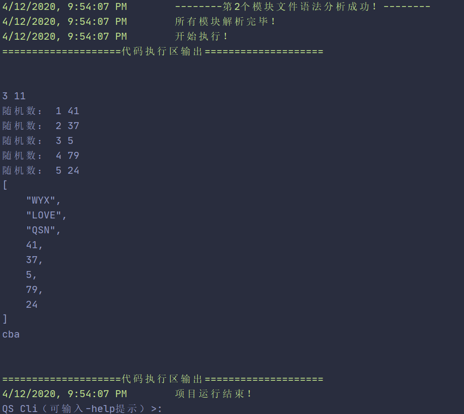

# QS

## 简介

**因目前正在读研，所做的研究方向（Domain Generalization in cv）与之不一致，目前已没有时间继续实现该语言的后续阶段，未来会进一步实现（可能会比较久）**

QS全名QinScript，是一门面向过程的脚本语言，语法参考了JS与C，属于个人实验性质项目。

*关于名字由来：e59ba0e4b8bae8bf99e698afe68891e8aebee8aea1e79a84e7acace4b880e4b8aae7bc96e7a88be8afade8a880efbc8ce8808ce68891e78eb0e59ca8e79a84e5a5b3e69c8be58f8be4b99fe698afe68891e79a84e5889de6818befbc8ce68980e4bba5e5b0b1e794a8e4ba86e68891e5a5b3e58f8be79a84e5a793efbc8ce4b99fe5b0b1e698af51696eefbc88e7a7a6efbc89e4bd9ce4b8bae5bc80e5a4b4efbc8ce5908ce697b6e59ba0e4b8bae698afe8849ae69cace8afade8a880efbc8ce68980e4bba5e58f88e59ca8e5908ee99da2e58aa0e4ba86e4b8aa536372697074efbc8ce8bf99e5b0b1e69e84e68890e4ba8651696e5363726970740a*

## 语言元素

### 模块

QS中一个文件就是一个模块。

  - 模块定义使用`@module: 模块名`来定义，模块定义必须在第一行。

  - 模块导入使用`import: 模块名`来导入。

  - 模块中对于要导出的函数量使用`export: 导出对象`来定义。

  - 模块中要是用其它模块中导出的元素，需要使用模块名前缀：`模块名::导出元素`

- 一个QS项目中必须要有一个main函数（有且只有一个），该函数作为程序入口。
  样例：
  
    ```
    @module: Main;//Main模块
    import: Math;//导入Math模块
    export: temp;//导出temp变量
  
    let temp;//模块变量
    fun main(){//入口函数
    	let a = 12;
    	let b = 33;
    	let c = Math::min(a,b);//调用其它模块函数
    }
    ```

### 变量

QS中的变量定义使用let关键字，变量分为三种：模块变量、局部变量与静态变量。

变量类型有：

- string

- number

- boolean

- null

- array

- complexus（复合体，静态函数的返回值，详情见静态函数）

#### 模块变量

在QS的变量中，只有模块变量是可以导出的，在全局可以访问。

#### 局部变量

局部变量在函数内定义，根据局部变量定义时所处的作用域，只可以在该作用域或子作用域中访问，且可以被子作用域中同名局部变量覆盖。

#### 静态变量

静态变量只能在静态函数中定义，使用`static`关键字定义，可以与局部变量同名，在静态函数或内部函数中访问时需要加`@`前缀，在静态函数外部访问需要使用**复合体**类型的变量来间接访问。

样例：

```
static fun test(){//静态函数定义
	static let staticVariable = 0;//静态变量
	@staticVariable = 12;//静态变量访问
}
fun main(){
	let temp = test();//静态函数调用
	temp.staticVariable = 99;//静态变量访问
}
```

### 函数

QS语言中函数是第一成员，函数有三种，一种是普通函数，一种是静态函数，还有一种是内部函数，在QS中除内部函数外都可以导出。

#### 普通函数

普通函数拥有的功能与其他语言中的函数完全一致，因此不进行详细说明了，看样例即可。

样例：

```
fun test(arg1,arg2){//普通函数定义
	//语句
}
```

#### 静态函数、内部函数

静态函数属于模块内部，使用`static`关键自定义，内部函数属于静态函数内部，定义与普通函数一致，但需要加前缀`@`。

##### 详细说明

- 静态函数可以视为劣化版的类或是进阶版结构体，它介于二者之间，执行后会将内部的静态变量与内部函数一个整体返回，在这里称这个返回值为**复合体**。
- 静态函数有**静态变量**，可视为成员变量，且**只有静态函数才有静态变量**。
- 静态函数有**内部函数**，内部函数与普通函数完全一样，除了**不可以直接调用**，可以将它视为成员方法，且**只有静态函数有内部函数**。
- 静态函数与普通函数使用**完全一致**，除了**没有return语句**，可以单独调用，也可以赋值给一个变量。
- 静态函数单独调用与普通函数的单独调用，在**功能上完全一样**。
- 静态函数如果赋值给变量，则该变量称为**复合体变量**。
- 静态函数在调用之后，会执行除内部函数的其它语句，**可认为这是对静态函数的内部函数以及静态变量的初始化过程**。
- 静态变量与内部函数也**属于语句**，**可以包裹在控制语句中**，但**不可以使用循环语句包裹**，换句话说，**静态变量与内部函数可以在调用静态函数的时候动态生成**。
- 静态变量与内部函数在静态函数内**只可定义一次，多次定义会出错**。
- 在**静态函数外部访问静态变量与内部函数**时，**必须通过复合体变量来间接访问**，不可以直接访问，访问方式是`复合体变量.静态变量或内部函数`。
- 在静态函数中，静态变量与内部函数**只可以在内部函数中或是通过复合体变量调用**，**不可以在执行静态函数时使用。**
- 静态变量与函数的局部变量不冲突，内部函数与普通函数不冲突，**但静态变量与内部函数是冲突的，在**静态函数内**使用静态变量需要**使用`@`做前缀**，在内部函数中调用本静态函数的其它内部函数**也需要使用`@`做前缀。**
- 内部函数**只可访问静态函数的静态变量或模块变量**，**不可以访问静态函数的局部变量**。

样例：

```js
static fun staticFun( val ){//静态函数定义
	static let staticVariable = 0;//静态变量定义与初始化
	//@staticVariable = 12;错误示例，静态变量不可在执行静态函数时使用
	@fun innerFun0(){//内部函数
		return 0;
	}
	//@innerFun0();错误示例，内部函数不可在执行静态函数时使用
	if(val == 0){//动态定义同一个内部函数的不同版本
		@fun innerFun(){//内部函数
			@staticVariable = @innerFun0();//调用其它内部函数
		}
	}else{
		@fun innerFun(){//内部函数
            @staticVariable = 88;//(排版有毒，怎么都对不齐。。。)
		}
	}
}
fun main(){
	let temp = staticFun(1);//静态函数调用
	temp.staticVariable = 99;//静态变量访问与赋值
	//因为动态创建的时候val的值为1，所以是else中的innerFun被执行了。
	temp.innerFun();
	//print为原生函数，用于打印数据
	print(temp.staticVariable);//打印结果为88
}
```

### 作用域

**同一作用域下的变量名与函数名不可重名**

1. 模块作用域下，**模块变量与模块下的函数冲突**，即不可与普通函数或静态函数重名。
2. 静态函数作用域下，**静态变量与内部函数冲突**。
3. 局部作用域下，**局部变量与所有函数均不冲突**。

### 语句

以下语句样例均不包含静态函数相关语句，静态函数的语句可以参考上文中的样例。

#### 定义语句

```js
let a;//模块变量定义

fun fun2(){//普通函数定义
	let b = 99;//局部变量定义
}

```

#### if语句

```js
if(表达式){
	语句;
}else{
	语句;
}
```

#### while语句

```js
while(表达式){
	语句;
}
```

#### 函数调用语句

```js
fun0(表达式列表);
```

#### return语句

```js
return 表达式;
return;
```

#### 赋值语句

```js
ID = 表达式;
ID[表达式] = 表达式
```

#### 表达式

```js
ID;
1 * 12 + 43 - 4;
"11231254231";
[1, 2, 3];
```

### 注释

QS中支持单行注释与多行注释，具体的注释方式与C或JS完全一致。

#### 单行注释

```c
//这是单行注释
```

#### 多行注释

```c
/*这是多行注释
* 这是多行注释
* 这是多行注释
*/
```

## QS实现概述

QS使用模块化设计，一共有四个模块，词法分析器、语法分析器、解释器以及虚拟机。

**注：此处只是简单介绍一下，正在准备相关[系列文章](https://zhuanlan.zhihu.com/p/126741399)对源码进行解读。**

### 开发环境介绍

QS的实现准备分为两部分进行，第一部分包含：词法分析器、语法分析器以及解释器，第二部分为虚拟机，虚拟机包含：字节码执行器、JIT以及GC部分。

对于开发语言的选择方面，我综合考虑了许多语言，包括：C、Java、Python、JavaScript、TypeScript以及C++。

C由于太过基础，实现起来需要写的代码就比较多；Java语法糖实在太繁琐了，写起来束手束脚的；JS与PY虽然写起来比较方便，但没有类型，估计BUG会很难发现，最后敲定用C++和TS。

大致上准备第一部分先用TS写第一版，因为开发效率高，用于验证思路的正确性，然后使用C++重构一遍，并进行一些优化处理；对于第二部分，也就是虚拟机部分，直接用C++写，因为TS没法做底层开发（虽然有扩展库，但兼容性是个问题）。

由于现在写的是第一部分，所以只需要搭建好TS部分的环境即可，在开发中，我没有使用任何辅助性框架，也就是说全部都是自己手写的。

开发工具：WebStrom、Node.js、yarn、Clion、Visual Studio。

前三个用于开发第一部分，后两个用于开发第二部分（暂时用不到）

### 项目核心目录结构介绍


 此处简单介绍一下项目整体的目录结构。

1. 根目录下的QS文件夹里面是一个QS项目。

   - out文件夹里面是该QS项目的一些输出文件，包括构建的LR(1)分析表缓存数据，项目日志数据，语言终结符与非终结符和词法分析的Token等。

   - src里面包含当前版本以及后续版本的语法文件和被测试的QS项目文件。

2. 根目录下的Src文件夹里面是对QS实现的具体代码文件。

   - cli是命令行工具。
   - Interpreter是QS解释器。
   - Lexer是词法分析器。
   - Log为日志输出，包含对错误以及警告等信息的日志输出。
   - Parser是语法分析程序，包含对语法文件的解析，语法树的生成等。
   - Project主要是对QS项目路径的解析读取。
   - QSLib是QS的原生库函数（TS版比较简单，不准备再添加了，后期准备C++版）。
   - Test是对一些模块进行单独的测试。
   - Utils是一些工具类
   - main是整体项目的入口。

*PS：有一些项目目录下面比较混乱，一直没高兴去整理，还请见谅。*

### 词法分析器

词法分析器的源码均在[lexer文件夹](src/Lexer)下，主程序是[Lexer.ts](src/Lexer/Lexer.ts)，词法分析器是手工编码的方式进行实现的。

### 语法分析器 

语法分析源码在[parser文件夹下](src/Parser)，主程序是[ParseModule.ts](src/Parser/ParseModule.ts)，使用LR1语法分析方法，主要分为两个部分，一个部分是[解析器](src/Parser/AnalyzeGrammar/Index.ts)，用于解析[语法文件](QS/src/grammar/grammar.txt)，并生成对应的LR1分析表，另一部分是[语法树生成器](src/Parser/BuildAST/Index.ts)，用于构建语法树，供解释器执行时使用。

### 解释器

解释器源码在[Interpreter文件夹](src/Interpreter)下，主程序是[Index.ts](src/Interpreter/Index.ts)。

### 虚拟机

#### TODO

## 运行方式

>1. 安装[node.js](https://nodejs.org/en/)。
>2. 安装[Yarn](https://classic.yarnpkg.com/en/)。
>3. 使用命令行到项目根目录下。
>4. 执行`yarn install`进行依赖安装。
>5. 执行`yarn run dev`运行。

---


## 开发计划
整体开发准备分为五个阶段。

### 当前开发状态：
>前两阶段开发完成，由于精力有限，可能会有一些未知的bug，还请在issues中提出。


- 当前阶段运行样例
```js
@module:Main;
import:Test;
static fun Stack(len) {
    static let x = array(len,0);
    static let index = 0;
    @fun push(el){
        @x[@index++] = el;
    }
    @fun pop(){
        return @x[@index--];
    }
    @fun getX(){
        //只返回有值的部分
        let res = array(@index);
        let index = 0;
        while(index < @index){
            res[index] = @x[index++];
        }
        return res;
    }
    @fun getSize(){
        return @index;
    }
}

fun main(){
    //测试静态函数、多维数组
    let stack = Stack(100);
    let x= array(100,0);
    x[0]=[1,2,3];
    x[1]=11;
    print(x[0][2],x[1]);
    stack.push("WYX");
    stack.push("LOVE");
    stack.push("QSN");
    let len = 10;
    let index = 0;
    while(index++<len){
        let value = randomInteger(0,100);
        print("随机数：",index,value);
        stack.push(value);
    }
    print(stack.getX());
    //测试多模块
    let str = "abc";
    str = Test::reverseStr(str);
    print(str);
}

```

```js
@module:Test;
export:res;
export:test;
export:reverseStr;
let res=test("这是Test模块的res");

fun test(str){

    return str;
}

fun reverseStr(str){
    let temp = "";
    let index = len(str)-1;
    while(index>=0){
        temp = temp + str[index--];
    }
    return temp;
}
```
- 输出结果：



### 第一阶段

#### 任务

此阶段的任务主要是：文法设计、词法分析、LR1分析表构建、语法树部分构建、解释器部分构建，部分语言功能的实现。

该阶段主要保证项目的整体可运行性，构建基础设施，带有测试目的。

#### 需要完成的功能

- 整体结构上，仅支持单模块，不支持多模块导入等功能。
- 数据类型上暂时支持：string、number、boolean与null
- 语句方面，暂时支持：普通函数定义、模块变量与局部变量定义、call语句、block语句、assign语句、while语句、return语句、可计算表达式（calExp）。
- 标准库方面，实现原生函数print()

#### 进度

- [x] [文法设计](QS/src/grammar/grammar.txt)
- [x] 词法分析
- [x] LR1分析表构建
- [x] AST部分构建
- [x] 解释器部分构建
- [x] 语言功能的部分实现

### 第二阶段

- 计划实现AST的全部构建，解释器的全部构建，实现TS版的全部语言功能，发布V1.0.0

#### 功能进度

- [x] IF语句
- [x] 多维数组
- [x] 多模块加载
- [x] 静态函数
- [x] 命令行工具

**PS：对于数组与静态函数的实现上，由于没法用指针，用了些取巧的办法，所以并不稳定，二者一起用的时候极有可能出现bug。**

### 第三阶段（TODO）

- 计划实现C++版，但不实现解释器，解释部分由虚拟机来承担，添加字节码生成器。

PS：之前是没有这个阶段的，但后来发现TS虽然效率不错，但性能着实捉急，然后在写复合体这个功能的时候加剧了我这一想法，本来准备参考V8对object的实现的，然而发现，V8里面object的实现各种指针，完全没法参考，现在的实现相当于给js原生的object套了几层壳。。准备等前两阶段完成后，再用C++全部重构一遍，并做优化处理。

### 第四阶段（TODO）

- 设计并实现一部分虚拟机（先支持一些简单的语言元素，保证可以运行起来），包括设计一套字节码，编写字节码执行器、GC、以及JIT。

### 第五阶段（TODO）

- 实现完整的虚拟机

### PS

上述的第二阶段之后的今年应该没有时间做，因为4月开始要准备考研事宜，所以只准备完成前两个阶段，后面的等考研结束再实现。


## 参考资料

### 书籍：

- [编译器设计](https://book.douban.com/subject/20436488/)
- [自制编程语言 基于C语言](https://book.douban.com/subject/30311070/)

### 视频：

- [编译原理](https://www.icourse163.org/course/NUDT-1003101005)

### Git项目：

- https://github.com/Xiang1993/jack-compiler
- https://github.com/dejavudwh/C2j-Compiler
- https://github.com/Yaser-wyx/the-super-tiny-compiler-modified

### 博客：

- https://www.cnblogs.com/secoding/p/11393720.html
